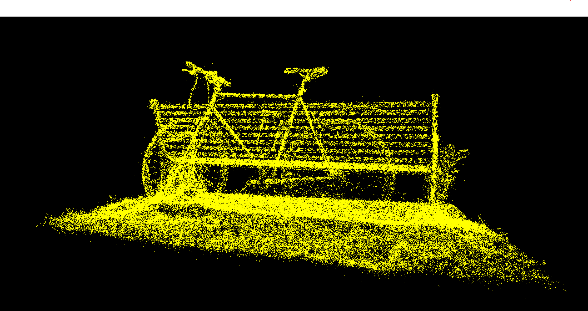
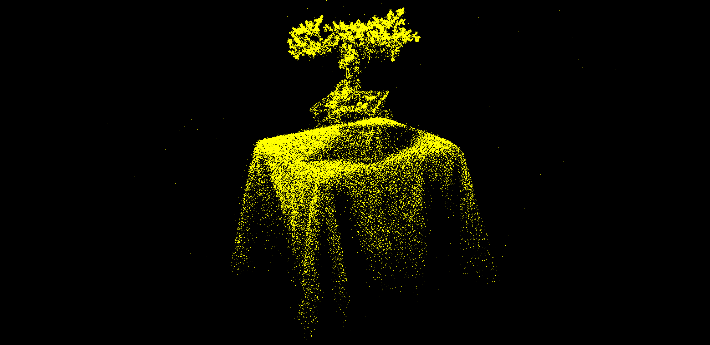

# WebGPU Gaussian Splat Viewer

**[Live Demo](https://siwel-cg.github.io/Project5-WebGPU-Gaussian-Splat-Viewer/)**

## Overview

**Gaussian Splatting** is a neural rendering technique for reconstructing scenes from posed images. Instead of dense voxels or a full neural field (e.g., NeRF), the scene is represented as a set of *3D Gaussians*. Each Gaussian stores position, color, opacity, and a covariance that encodes local geometric shape. During rendering, Gaussians are projected to the screen as textured quads and blended using alpha compositing in screen space.

This project is a **WebGPU-based splat viewer** that loads a `.ply` splat file and renders it in real time. The pipeline has three main stages:

1. **Preprocess** the Gaussian point cloud (color, covariance, opacity, quad size, NDC position), with simple frustum culling.
2. **Depth sort** splats using a GPU radix sort implementation.
3. **Render** screen-oriented quads and shade them with Gaussian falloff in the fragment shader, composited back-to-front.

For more information, see the [original 3D Gaussian Splatting paper](https://repo-sam.inria.fr/fungraph/3d-gaussian-splatting/3d_gaussian_splatting_high.pdf).

## Point Clouds

The input is a set of 3D points with attributes (e.g., color, normals). While this representation is sparse and discontinuous, it becomes visually dense once each point is rendered as a Gaussian splat.

| Bicycle | Bonsai |
|---------|--------|
|  |  |

## Gaussian Splatting

### Quads

Each 3D Gaussian is projected to the screen and rendered as a **screen-aligned quad** whose size bounds the Gaussian's projected ellipse. After projecting the Gaussian center to NDC, we compute a screen-space covariance and derive a 2×2 ellipse. The quad is chosen large enough to cover this ellipse so that the Gaussian falloff can be evaluated per-pixel in the fragment shader.

*Screen-aligned quads sized to bound each splat's projected footprint.*

### Colors and Covariance

**Appearance:** Instead of storing a fixed RGB value per splat, each splat stores **spherical harmonic (SH) coefficients**. At render time, the view direction selects an SH evaluation to produce view-dependent color.

**Covariance:** The covariance matrix encodes the anisotropic shape of the Gaussian ellipsoid in 3D. Before rasterization, the 3D covariance is transformed to a 2D covariance in screen space, which dictates the falloff profile across the quad. After preprocessing, splats are **sorted back-to-front** for correct alpha compositing.

*Depth-sorted splats without alpha blending.*

## Output

| Bicycle | Bonsai |
|---------|--------|
|  |  |

## Built With

- WebGPU
- TypeScript
- WGSL

## Credits

- [Vite](https://vitejs.dev/)
- [tweakpane](https://tweakpane.github.io/docs//v3/monitor-bindings/)
- [stats.js](https://github.com/mrdoob/stats.js)
- [wgpu-matrix](https://github.com/greggman/wgpu-matrix)
- [Differential Gaussian Renderer](https://github.com/graphdeco-inria/diff-gaussian-rasterization)
- [3D Gaussian Splatting paper](https://repo-sam.inria.fr/fungraph/3d-gaussian-splatting/3d_gaussian_splatting_high.pdf)
- Special thanks to: Shrek Shao (Google WebGPU team)