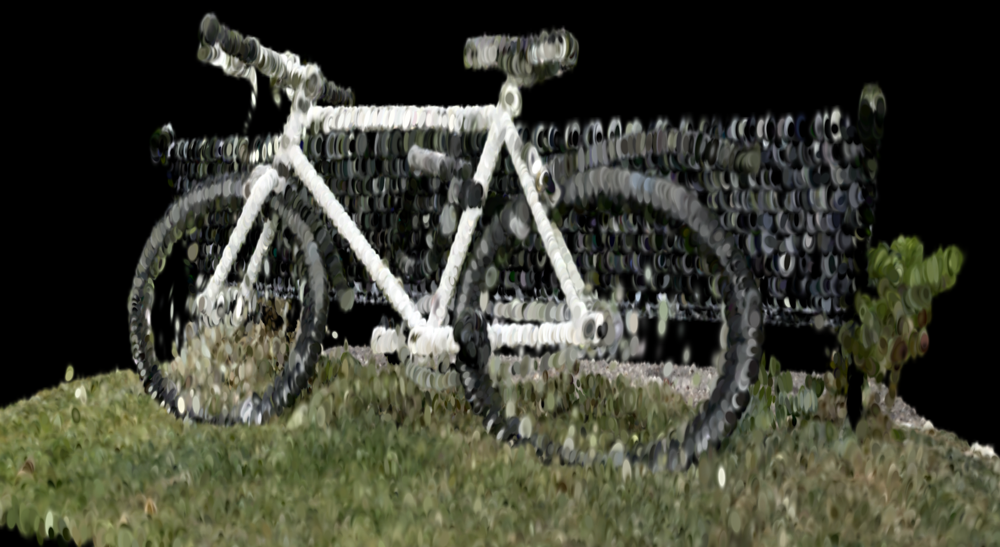
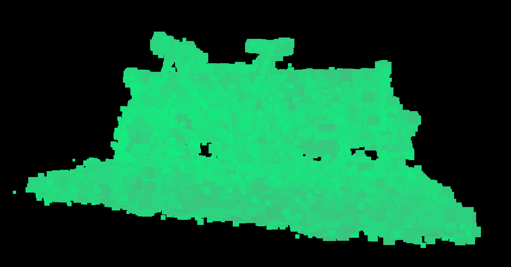
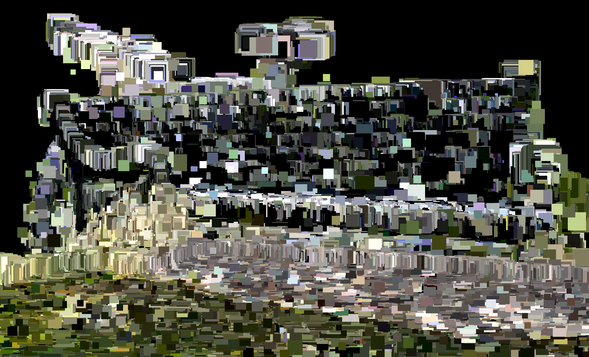
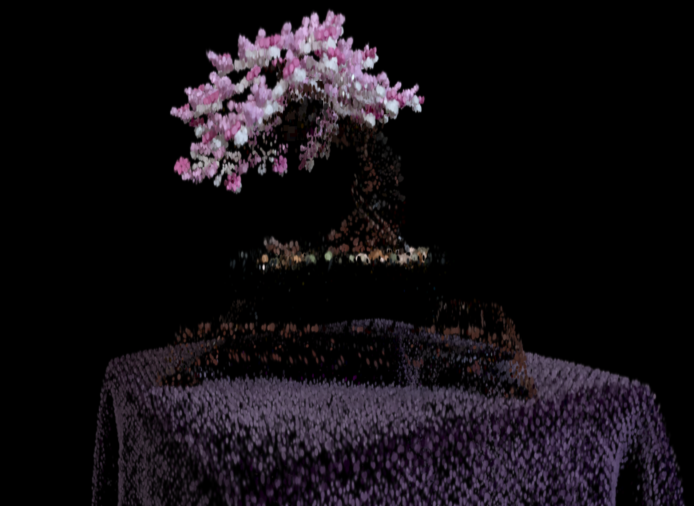

# Project5-WebGPU-Gaussian-Splat-Viewer

**University of Pennsylvania, CIS 565: GPU Programming and Architecture, Project 5**

* Lewis Ghrist
* [Personal Website](https://siwel-cg.github.io/siwel.cg_websiteV1/index.html#home), [LinkedIn](https://www.linkedin.com/in/lewis-ghrist-4b1b3728b/)
* Tested on: Windows 11, AMD Ryzen 9 5950X 16-Core Processor, 64GB, NVIDIA GeForce RTX 3080 10GB

# Live Demo

[LIVE DEMO](https://siwel-cg.github.io/Project5-WebGPU-Gaussian-Splat-Viewer/)

# Demo Video

<video src="images/GSBikeDemo_V1.mp4"
       controls
       loop
       muted
       playsinline
       width="720"
       poster="images/Bicycle_GS_V1.png">
  Sorry—your browser can’t play this video. Here’s a
  <a href="images/GSBikeDemo_V1.mp4">direct link</a>.
</video>

# Overview
Gaussian Splatting is a recent neural rendering technique for reconstructing photorealistic scenes from posed images. Instead of representing the scene with dense voxels or a full neural field (as in NeRF), the method stores the scene as a set of 3D Gaussians, each with position, color, opacity, and covariance that encodes local geometric shape. During rendering, these Gaussians are projected to the screen as textured quads and blended using alpha compositing in screen space. Basically, it is a dense set of "fuzzy" elipsoids which blend togeather to form the image. Because all computation happens in rasterization rather than volume ray-marching, Gaussian Splatting achieves fast real-time rendering with high fidelity.

In this project I implemented a WebGPU based splat viewer which takes in a .ply splat file. There are three main passes. First, we preprocess the gaussian point cloud, computing the color, covariance, opacity, quad size, and NDC position for all of our splats. During this, some simple frustrum culling is used to increase render speeds in large scenes. The positional data for each splat is then sent to a GPU Radix sort implementation for depth sorting. This is crucial for the final rendering stage where a vertex buffer creates the screen oriented quads, and a fragment shader shades the quads with our Gaussian data. 

# Point Clouds
As mentioned, the input to the method is simply a set of 3D points with attributes such as color or normals. This raw representation is sparse and discontinuous, but as you will see later, is enough to cover the entire scene when the splats are applied.

# Gaussian Splatting
Now that we have a basic point cloud system working, we can start the Splat pipeline:

## Quads
The first step is creating a quad for each point where we will eventually render the splats. Each Gaussian in 3D is rendered on screen as a screen-aligned quad whose extent approximates the projected footprint of the Gaussian ellipsoid. After projecting the Gaussian center to NDC, we compute its covariance in screen space and derive a 2×2 ellipse. The quad is then chosen large enough to tightly bound this ellipse so that the Gaussian falloff can be evaluated in the fragment shader.

## Colors and Covariance
Each Gaussian carries two main components:

**Appearance**  
Each splat stores spherical harmonic coefficients instead of a fixed RGB value. At render time we look up the view direction and evaluate the SH basis to get a view-dependent color. This allows the splat to reproduce effects that vary with angle without storing a full BRDF or running a lighting pass.

**Covariance**  
The covariance matrix encodes the anisotropic shape of the Gaussian ellipsoid in 3D. Unlike a
uniform point radius, this allows each primitive to stretch or flatten along directions that
best approximate local geometry. Before rasterization, the 3D covariance is pushed through the
camera transform to produce a 2D covariance in screen space. That matrix dictates the falloff
profile of the Gaussian across the quad’s pixels. 

Together, the falloff from the 2D covariance and the color get mapped to each corrisponding quad similar to a texture. Before doing our final render pass, all the positions are sorted back to front for propper alpha blending when the splats get stacked up togeather. 

# Output

# Performance Analysis

### Credits

- [Vite](https://vitejs.dev/)
- [tweakpane](https://tweakpane.github.io/docs//v3/monitor-bindings/)
- [stats.js](https://github.com/mrdoob/stats.js)
- [wgpu-matrix](https://github.com/greggman/wgpu-matrix)
- Special Thanks to: Shrek Shao (Google WebGPU team) & [Differential Guassian Renderer](https://github.com/graphdeco-inria/diff-gaussian-rasterization)

